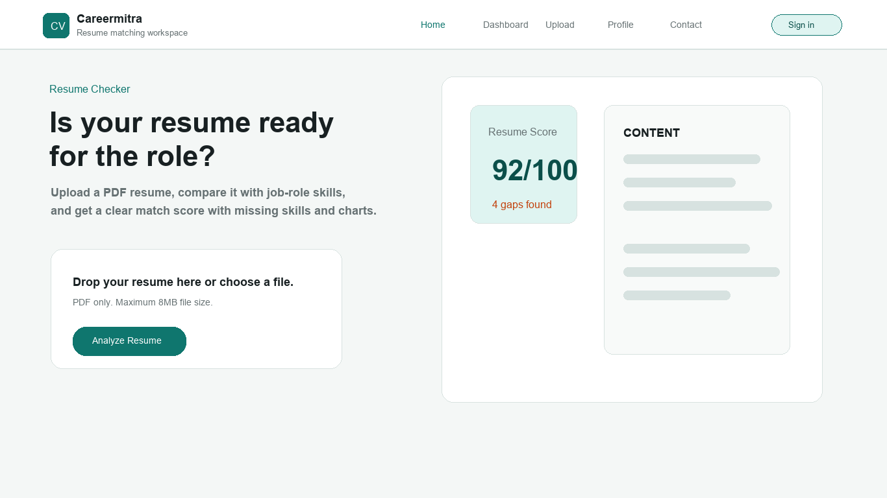
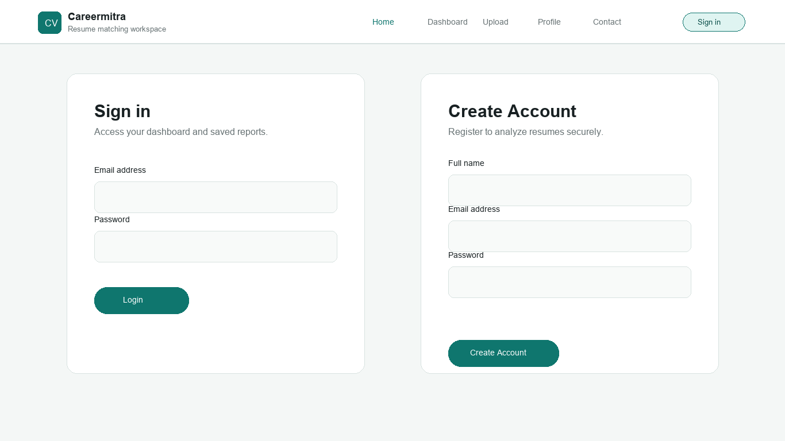
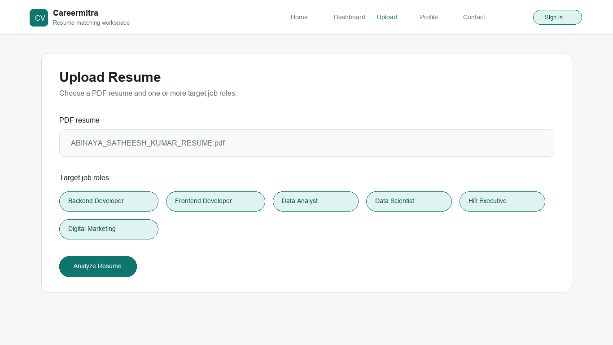
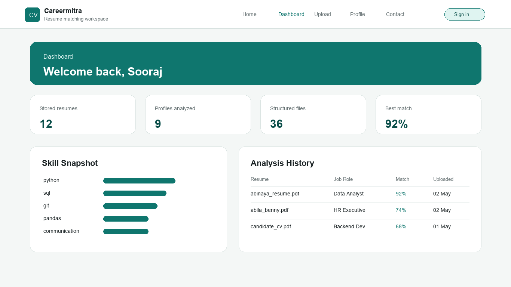
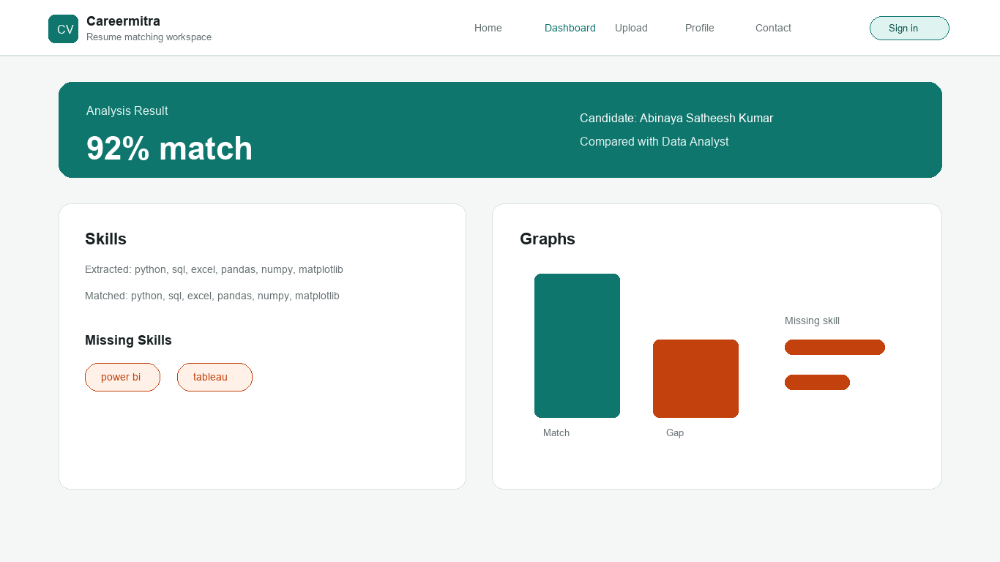

# CAREERMITRA - RESUME SKILL GAP ANALYSIS SYSTEM

A project report submitted in partial fulfillment of the requirements for the certification of

**ADVANCED PYTHON**

Submitted by

**SOORAJ**

May 2026

---

## LIST OF FIGURES

| SL No. | Figure | Page No. |
| --- | --- | --- |
| Fig 4.1.1 | System Architecture of Careermitra | 13 |
| Fig 4.2.1 | Data Flow Diagram | 14 |
| Fig 4.3.1 | Database Relationship Structure | 14 |
| Fig 11.2.1 | Home Page | Appendix |
| Fig 11.2.2 | Login and Registration Pages | Appendix |
| Fig 11.2.3 | Resume Upload Page | Appendix |
| Fig 11.2.4 | Dashboard and Analysis History | Appendix |
| Fig 11.2.5 | Skill Match Result Page | Appendix |

---

## LIST OF ABBREVIATIONS

| Abbreviation | Full Form |
| --- | --- |
| API | Application Programming Interface |
| CRUD | Create, Read, Update, Delete |
| CSS | Cascading Style Sheets |
| DBMS | Database Management System |
| HTML | HyperText Markup Language |
| HTTP | HyperText Transfer Protocol |
| JSON | JavaScript Object Notation |
| PDF | Portable Document Format |
| RDBMS | Relational Database Management System |
| SQL | Structured Query Language |
| UI | User Interface |
| UX | User Experience |
| WSGI | Web Server Gateway Interface |

---

## TABLE OF CONTENTS

| Content | Page No. |
| --- | --- |
| Abstract | 5 |
| 1. Problem Definition | 6 |
| 1.1 Overview | 6 |
| 1.2 Problem Statement | 6 |
| 2. Introduction | 8 |
| 3. System Analysis | 9 |
| 3.1 Existing System | 9 |
| 3.2 Proposed System | 9 |
| 3.3 Feasibility Study | 10 |
| 3.4 Technologies Used | 11 |
| 3.5 Language Specifications | 11 |
| 4. System Design | 13 |
| 4.1 System Architecture | 13 |
| 4.2 Data Flow | 14 |
| 4.3 Database Design | 14 |
| 5. Project Description | 16 |
| 6. System Testing and Implementation | 18 |
| 6.1 System Testing | 18 |
| 6.2 System Implementation | 19 |
| 7. System Maintenance | 20 |
| 8. Future Enhancements | 21 |
| 9. Conclusion | 22 |
| 10. Bibliography | 23 |
| 11. Appendix | 24 |

---

## ABSTRACT

Careermitra - Resume Skill Gap Analysis System is a web-based application developed using the Flask framework. The main objective of the project is to help job seekers, students, placement teams, and training coordinators evaluate how well a resume matches the skills required for a selected job role. In the current recruitment environment, candidates often apply for different roles without a clear understanding of whether their resume contains the skills expected by employers. Manual resume checking requires time, repeated reading, and subjective judgment. Careermitra reduces this effort by automating resume upload, text extraction, skill detection, role comparison, result storage, and graphical reporting.

The system allows users to register, log in, upload a PDF resume, select one or more target job roles, and generate a skill gap analysis report. The uploaded resume is processed on the server, readable text is extracted, and known skills are identified using a predefined skill library. These extracted skills are compared with the required skills of the selected job role. The final output includes extracted skills, matched skills, missing skills, match percentage, and two generated graphs that visually represent the resume's skill coverage.

The application is implemented using Python, Flask, SQLite, HTML, CSS, JavaScript, Bootstrap, PyMuPDF, NumPy, Pandas, and Matplotlib. SQLite is used as the local relational database to store user accounts, profiles, job roles, skills, resume metadata, uploaded resume records, and analysis results. PyMuPDF and custom PDF parsing logic support resume text extraction. Pandas and NumPy are used for structured calculations, while Matplotlib creates graphical reports saved as image files and displayed through the result page.

Careermitra also includes useful supporting features such as secure password hashing, session-based login, user profiles, contact message storage, resume history, result download links, bulk record deletion, and admin-level visibility over records. The project demonstrates how Python can be used to build a practical career-support application by combining web development, file handling, database management, regular expression processing, and data visualization.

In conclusion, Careermitra provides a simple and effective platform for automated resume skill analysis. It helps users identify their strengths and missing skills, supports better career preparation, and reduces the manual workload involved in comparing resumes with job-role requirements.

---

# 1. PROBLEM DEFINITION

## 1.1 OVERVIEW

Resume screening is an important activity in career preparation and recruitment. A resume represents a candidate's education, experience, skills, tools, and achievements. However, many candidates do not know whether the skills mentioned in their resume are sufficient for a specific job role. For example, a candidate applying for a Data Analyst role may mention Python and Excel but may miss SQL, Power BI, Pandas, or Matplotlib. Similarly, a candidate applying for a Backend Developer role may have Python experience but may not include databases, REST API development, Git, Docker, or related backend technologies.

Traditional resume evaluation is generally manual. A recruiter, trainer, or placement officer reads the resume and compares it with a job description. This process becomes slow when many resumes are involved. It can also become inconsistent because different reviewers may focus on different keywords or interpret the same resume differently. Manual evaluation also does not always provide candidates with clear feedback about missing skills.

Careermitra is designed to solve this problem through a simple web-based system. Users can upload a PDF resume and select the job role they want to compare it with. The system extracts text from the resume and searches for known skill patterns. It then compares the extracted skills with the required role skills and presents the analysis in a structured result page.

The project is useful in academic and placement environments because it gives students a quick way to understand their resume readiness. It is also useful for small organizations and training centers that need a lightweight resume checking tool without depending on a complex recruitment platform.

## 1.2 PROBLEM STATEMENT

The main problem addressed by this project is the lack of a simple, automated, and understandable system for comparing a resume with job-role skill requirements. Candidates often create resumes without knowing whether the document contains the keywords and skills expected for a role. Recruiters and placement coordinators also face difficulty in manually checking many resumes.

The major issues identified are:

- Difficulty in manually comparing resume content with job-role requirements.
- Time-consuming review process when multiple resumes are submitted.
- Inconsistent results due to subjective manual judgment.
- Lack of organized storage for uploaded resumes and generated analysis.
- Absence of automatic match percentage calculation.
- Poor visibility into missing skills that a candidate should improve.
- Need for simple charts and reports that explain resume-job compatibility.
- Requirement for a secure login system so user records remain private.

To overcome these issues, Careermitra provides a digital platform that automates the resume analysis workflow. The system extracts readable text from PDF resumes, detects known skills using regular expression patterns, loads required job-role skills from the database, calculates the match percentage, stores the result, and presents the output through a clean web interface.

The project aims to:

- Build a Flask-based web application for resume analysis.
- Provide secure user registration and login.
- Allow PDF resume upload with file validation.
- Extract text from uploaded PDF documents.
- Maintain a predefined library of job roles and required skills.
- Compare extracted resume skills with role requirements.
- Display matched and missing skills clearly.
- Generate graphical reports using Matplotlib.
- Store users, resumes, job roles, and analysis results in SQLite.
- Provide dashboard and profile pages for managing saved data.

---

# 2. INTRODUCTION

In the present employment market, skill-based hiring has become very important. Companies increasingly look for candidates who can demonstrate practical knowledge of programming languages, frameworks, databases, cloud tools, communication skills, and role-specific technologies. A resume must therefore contain the right set of skills for the target role. If important skills are missing or not clearly mentioned, a candidate may be filtered out during screening even if they have relevant ability.

Careermitra - Resume Skill Gap Analysis System is developed to assist candidates in identifying such gaps. The project provides an easy-to-use web interface where a user can upload a PDF resume and choose a target job role. The system then analyzes the resume and generates a skill gap report. This report includes extracted skills, matched skills, missing skills, match percentage, and visual charts.

The application is built using Flask, a lightweight Python web framework. Flask is suitable for this project because it allows flexible route handling, template rendering, file upload processing, and integration with Python libraries. The backend logic is written in Python and divided across multiple modules for clarity. The frontend pages are written using HTML, CSS, JavaScript, and Bootstrap. The project uses SQLite as the database because it is lightweight, serverless, and convenient for academic and demonstration projects.

The system supports several job roles, including Backend Developer, Frontend Developer, Full Stack Developer, Data Analyst, Data Scientist, Machine Learning Engineer, DevOps Engineer, Cloud Engineer, QA Engineer, Mobile App Developer, Business Analyst, UI/UX Designer, Accountant, Tally Operator, HR Executive, Digital Marketing Executive, Office Administrator, and others. Each role has a list of required skills stored through the skill library and seeded into the SQLite database.

When a user uploads a resume, the system validates that the file is a PDF and checks the upload size limit. The file is saved in the storage area, and the text is extracted. The extracted resume text is processed against the skill library. The application then calculates how many required role skills are present in the resume and how many are missing. This calculation is converted into a match percentage. For example, if a role requires eight skills and six are detected in the resume, the match percentage becomes 75 percent.

The result page provides a simple visual interpretation of the analysis. Matplotlib generates a bar chart showing match and gap percentage, along with another chart showing missing skill areas. These images are saved under the static generated folder and displayed in the result page. This makes the output easier to understand than a plain text list.

The project also includes data management features. Users can view their dashboard, review previous analysis history, manage uploaded resumes, delete records, update profile details, and submit contact messages. Admin users can view broader uploaded resume records. Passwords are not stored as plain text; the system uses salted PBKDF2 hashing for safer authentication.

Overall, Careermitra combines web application development, database design, PDF handling, regex-based text processing, data analysis, and graph generation into a single practical system. It is simple enough to run locally, but complete enough to demonstrate a real-world resume screening workflow.

---

# 3. SYSTEM ANALYSIS

System analysis is the process of understanding the current problem, identifying the limitations of existing methods, and defining the features of the proposed solution. For Careermitra, system analysis focuses on resume screening, skill comparison, database storage, and report generation.

## 3.1 EXISTING SYSTEM

In the existing manual system, resume evaluation is performed by reading a resume and checking whether the required job skills are present. This method is common in placement cells, small recruitment teams, and training institutes. Candidates may also manually compare their resumes with job descriptions.

The limitations of the existing system are:

- Manual resume checking takes significant time.
- Review accuracy depends on the person evaluating the resume.
- Important skill keywords may be missed during manual reading.
- Candidates may not receive structured feedback.
- Match percentage is not automatically calculated.
- There is no centralized storage of resume analysis history.
- Graphical reports are usually not available.
- Comparing one resume against multiple roles becomes repetitive.
- File organization becomes difficult when many PDF resumes are collected.

Because of these limitations, users need an automated system that can perform basic resume skill analysis quickly and consistently.

## 3.2 PROPOSED SYSTEM

The proposed system, Careermitra, is a web-based resume skill gap analysis application. It allows a registered user to upload a PDF resume, select job roles, and receive a generated skill comparison report. The system automates the steps that are normally done manually.

Main features of the proposed system:

**Secure User Registration and Login**  
Users can create an account using name, email, and password. Passwords are validated and stored using salted hash values. Login sessions are maintained using Flask session handling.

**Resume Upload**  
Users can upload PDF resumes through the upload page. The system validates file extension and upload size before storing the file.

**Text Extraction**  
The uploaded PDF is processed to extract readable text. The project includes PDF text recovery logic and also uses PyMuPDF for PDF reading support.

**Skill Detection**  
The system searches the extracted text for known skill names and aliases. Regular expression patterns are used to detect skills in a case-insensitive manner.

**Role-Based Comparison**  
Each job role has a predefined list of required skills. The system compares extracted resume skills with the selected role's required skills.

**Match Percentage Calculation**  
The application calculates the percentage of required skills found in the resume. NumPy is used to round and process the score.

**Graph Generation**  
Matplotlib generates visual graphs for match percentage and missing skills. These graphs are saved as image files and shown on the result page.

**Dashboard and History**  
Users can view stored resumes, generated reports, match scores, skill snapshots, and analysis history from the dashboard.

**Profile and Contact Management**  
Users can update profile details and submit contact messages. These records are stored in the database.

**Admin Support**  
Admin users can view broader resume records, making the system useful for placement or review workflows.

## 3.3 FEASIBILITY STUDY

A feasibility study determines whether the proposed system is practical and useful. Careermitra is feasible from technical, operational, and economic viewpoints.

### Technical Feasibility

The project is technically feasible because it uses widely available open-source technologies. Python provides strong support for web development, file handling, database access, data processing, and visualization. Flask is lightweight and suitable for small to medium web applications. SQLite does not require a separate database server, which simplifies installation and local execution.

The required Python libraries are listed in `requirements.txt`:

- Flask for the web application.
- Gunicorn for production WSGI serving.
- PyMuPDF for PDF processing.
- NumPy for numerical calculation.
- Pandas for structured data handling.
- Matplotlib for graph generation.

The project can run on a standard computer with Python installed. No special hardware is required.

### Operational Feasibility

The system is operationally feasible because it is simple for end users. A user only needs to register, log in, upload a resume, select job roles, and view the result. The interface provides pages for home, login, registration, dashboard, upload, profile, contact, and result. The workflow follows common web application patterns, so users can understand it quickly.

The application is also manageable for administrators or placement coordinators because uploaded records and reports are organized in the database and storage folders.

### Economic Feasibility

The project is economically feasible because it is built using free and open-source tools. SQLite is included with Python's standard ecosystem, and the other libraries can be installed using Python package management. The system does not require paid cloud services or external APIs for its core functionality.

### Schedule Feasibility

The application has a manageable scope for an academic Python project. Its modules are clear: authentication, file upload, text extraction, skill matching, database storage, graph generation, and report display. This makes it possible to design, implement, test, and maintain within a reasonable project timeline.

## 3.4 TECHNOLOGIES USED

| Technology | Purpose |
| --- | --- |
| Python | Main programming language for backend logic |
| Flask | Web framework for routing and request handling |
| SQLite | Local relational database |
| HTML | Structure of web pages |
| CSS | Styling and layout |
| JavaScript | Dashboard search and interactive frontend behavior |
| Bootstrap | Responsive UI components |
| PyMuPDF | PDF text processing support |
| Regular Expressions | Skill keyword and alias matching |
| NumPy | Match percentage calculation and rounding |
| Pandas | Structured handling of skill comparison values |
| Matplotlib | Graph generation for result visualization |
| Gunicorn | WSGI server for deployment |

## 3.5 LANGUAGE SPECIFICATIONS

The main programming language used in Careermitra is Python. Python is suitable for this project because it is readable, productive, and has excellent libraries for web development, file processing, databases, and visualization.

Important Python features used in the project include:

- Functions for modular backend logic.
- Dictionaries and lists for structured data handling.
- Type hints for better readability.
- File handling using `pathlib`.
- SQLite database access through `sqlite3`.
- Regular expressions through the `re` module.
- JSON serialization and deserialization.
- Password hashing using `hashlib.pbkdf2_hmac`.
- Date and time handling through `datetime`.
- UUID generation for unique record identifiers.

Frontend development uses HTML, CSS, and JavaScript. HTML defines the structure of pages, CSS provides visual styling, and JavaScript supports record filtering and selection behavior. Bootstrap is used to support responsive layout and form styling.

---

# 4. SYSTEM DESIGN

System design explains how the proposed system is structured and how its components interact. Careermitra is designed as a modular Flask application with separate files for routing, data storage, database schema, skill library, frontend templates, and static assets.

## 4.1 SYSTEM ARCHITECTURE

The application follows a typical web application architecture:

```text
User Browser
    |
    v
Flask Routes and Request Handlers
    |
    +--> Authentication and Session Management
    |
    +--> Resume Upload and File Validation
    |
    +--> PDF Text Extraction
    |
    +--> Skill Detection and Gap Calculation
    |
    +--> Graph Generation
    |
    v
SQLite Database and Storage Folders
    |
    v
Rendered HTML Result Pages
```

The browser sends requests to the Flask server. The Flask application validates requests and calls the appropriate functions. Uploaded files are stored in the `storage` directory. Analysis graphs are generated in the `static/generated` directory. User, resume, skill, and result information is stored in the SQLite database.

The main files in the project are:

| File or Folder | Purpose |
| --- | --- |
| `app.py` | Main Flask app, resume processing, analysis, graph generation, page contexts |
| `frontend.py` | Route registration for pages and POST actions |
| `data_store.py` | Database operations, authentication, records, profiles, resumes |
| `db_structure.py` | SQLite schema definitions |
| `skill_library.py` | Job roles, required skills, aliases, and regex patterns |
| `backend.py` | Database connection and simple template renderer |
| `templates/` | HTML templates for user pages |
| `static/` | CSS, JavaScript, and generated graph images |
| `storage/` | SQLite database, uploaded files, metadata, extracted text |

## 4.2 DATA FLOW

The data flow of the system is as follows:

```text
1. User registers or logs in.
2. User opens the upload page.
3. User selects a PDF resume and one or more target job roles.
4. Flask validates the uploaded file.
5. Resume file is saved under storage.
6. Text is extracted from the PDF.
7. The system detects known skills in the extracted text.
8. Required skills are loaded for the selected job role.
9. Extracted skills are compared with required skills.
10. Match percentage, matched skills, and missing skills are calculated.
11. Matplotlib graphs are generated and saved.
12. Analysis result is stored in SQLite.
13. User is redirected to the result page.
14. Dashboard displays saved analysis history.
```

This flow ensures that each uploaded resume creates a reusable record that can be viewed later.

## 4.3 DATABASE DESIGN

The application uses a SQLite database named `resumevault.sqlite3`. The schema is defined in `db_structure.py`.

Main database tables:

| Table | Description |
| --- | --- |
| `users` | Stores account information including name, email, password salt, password hash, role, and creation time |
| `user_profiles` | Stores profile information such as full name, phone, headline, and location |
| `contacts` | Stores contact form messages |
| `records` | Stores metadata and JSON analysis for uploaded records |
| `resumes` | Stores uploaded resume details and extracted text path |
| `job_roles` | Stores predefined job role titles and descriptions |
| `skills` | Stores unique skill names |
| `job_role_skills` | Maps job roles to required skills |
| `analysis_results` | Stores match percentage, extracted skills, matched skills, missing skills, graph paths, and creation time |

The database is normalized so that job roles and skills can be managed separately. The `job_role_skills` table creates a many-to-many relationship between roles and skills. The `analysis_results` table connects uploaded resumes, users, selected job roles, and generated reports.

Security is improved by storing password salt and hash separately instead of saving plain text passwords.

---

# 5. PROJECT DESCRIPTION

Careermitra is divided into several functional modules. Each module performs a specific part of the overall resume analysis workflow.

## 5.1 User Authentication Module

The authentication module allows users to register and log in. During registration, the system validates the user's name, email, and password. Passwords must meet length requirements and are stored using salted PBKDF2 hashing. During login, the entered password is hashed again with the stored salt and compared with the saved hash.

This module uses functions such as `create_user`, `authenticate_user`, `store_current_user`, `get_current_user`, and `clear_session`. Session data stores the logged-in user's id, name, email, and role.

## 5.2 Resume Upload Module

The upload module allows users to submit a PDF resume. The form accepts PDF files and requires users to choose target job roles. The backend checks file extension and size before processing. The maximum upload size is 8 MB.

Uploaded files are stored with secure filenames and unique identifiers. The project maintains both resume metadata and extracted text paths for future reference.

## 5.3 PDF Text Extraction Module

The system extracts readable text from PDF documents. The project includes logic for recovering text from PDF streams and also includes PyMuPDF support. Extracted text is normalized by removing unnecessary spacing and repeated blank lines. The cleaned text becomes the input for skill detection.

## 5.4 Skill Library Module

The skill library stores job roles and their required skills. It also defines aliases and regular expression patterns. For example, the skill `aws` can match both `AWS` and `Amazon Web Services`. The skill `git` can match `Git`, `GitHub`, or `GitLab`. This improves detection when resumes use different wording for the same skill.

The application includes technical roles such as Backend Developer, Frontend Developer, Data Analyst, Data Scientist, DevOps Engineer, Cloud Engineer, and QA Engineer, along with business and service roles such as Accountant, HR Executive, Receptionist, and Digital Marketing Executive.

## 5.5 Skill Gap Analysis Module

The analysis module compares extracted resume skills with required role skills. It identifies:

- Extracted skills: skills found in the resume.
- Matched skills: required skills that are present in the resume.
- Missing skills: required skills that are not present in the resume.
- Match percentage: percentage of required skills found.

The calculation is transparent and easy to explain. If a role has ten required skills and seven are found in the resume, the match percentage is 70 percent.

## 5.6 Graph Generation Module

The graph generation module creates visual outputs using Matplotlib. The first graph compares skill match and skill gap percentage. The second graph represents missing skills. These graphs are saved as PNG images in the `static/generated` directory and displayed on the result page.

## 5.7 Dashboard Module

The dashboard provides a summary of stored resumes, analyzed profiles, structured files, best match percentage, skill snapshot, and analysis history. Users can search records, open result pages, delete selected records, and manage old uploaded data.

## 5.8 Profile and Contact Module

The profile page allows users to update basic profile information such as full name, phone, headline, and location. The contact page allows users to send messages, which are stored in the `contacts` table.

## 5.9 Admin Functionality

The application supports user roles. A normal user can access their own records, while an admin can view broader records. This allows the same system to be used by individuals as well as placement coordinators.

---

# 6. SYSTEM TESTING AND IMPLEMENTATION

## 6.1 SYSTEM TESTING

System testing checks whether the application works according to the requirements. The following testing activities are suitable for Careermitra.

### Registration Testing

| Test Case | Expected Result |
| --- | --- |
| Register with valid name, email, and password | Account is created and user is redirected to dashboard |
| Register with duplicate email | System displays validation error |
| Register with short password | System displays password length error |
| Register with invalid email | System displays email validation error |

### Login Testing

| Test Case | Expected Result |
| --- | --- |
| Login with valid credentials | User session is created |
| Login with wrong password | Error message is shown |
| Access dashboard without login | User is redirected to login page |
| Logout from account | Session is cleared |

### Resume Upload Testing

| Test Case | Expected Result |
| --- | --- |
| Upload valid PDF under size limit | Resume is saved and analyzed |
| Upload unsupported file type | System rejects the file |
| Upload without selecting role | System displays validation error |
| Upload file over size limit | System displays upload size error |

### Skill Analysis Testing

| Test Case | Expected Result |
| --- | --- |
| Resume contains required skills | Skills are detected and matched |
| Resume misses role skills | Missing skills are listed |
| Select multiple job roles | Combined role skills are analyzed |
| Resume contains alias such as GitHub | Skill `git` is detected |

### Dashboard Testing

| Test Case | Expected Result |
| --- | --- |
| Open dashboard after analysis | Saved result appears in history |
| Search record by filename or skill | Matching record cards are filtered |
| Delete selected records | Selected records are removed |
| Open result link | Result page displays saved analysis |

## 6.2 SYSTEM IMPLEMENTATION

The system is implemented as a modular Flask application. The main implementation starts in `app.py`, where the Flask application is created, configuration values are set, and route handlers are connected through `frontend.py`.

Important implementation details:

- `create_app()` initializes the Flask application.
- `register_routes()` registers GET and POST routes.
- `ensure_storage()` prepares storage folders and initializes the database.
- `seed_job_roles()` inserts predefined roles and skills.
- `flask_upload_to_dict()` converts Flask uploaded files into processable dictionaries.
- `analyze_uploaded_resume()` performs the complete upload and analysis workflow.
- `extract_skills_from_text()` detects skills from resume text.
- `calculate_skill_gap()` calculates matched skills, missing skills, and percentage.
- `save_analysis_graphs()` creates Matplotlib graph images.
- `insert_analysis_result()` stores the final analysis in SQLite.

The frontend is implemented with templates in the `templates` folder. These templates use placeholder values that are replaced by the custom renderer in `backend.py`. The styling is provided by `static/style.css`, while dashboard interactivity is supported by `static/app.js`.

The database is initialized using `db_structure.py`. All required tables are created if they do not already exist. This makes the system easy to run on a new machine because the database structure is prepared automatically.

---

# 7. SYSTEM MAINTENANCE

System maintenance is necessary to keep the application useful, secure, and reliable after implementation. Careermitra can be maintained in the following ways:

**Skill Library Updates**  
Job roles and required skills should be reviewed regularly because industry requirements change over time. New frameworks, tools, and role-specific skills can be added to `skill_library.py`.

**Database Backup**  
The SQLite database stores users, resumes, contacts, and analysis results. Regular backups of the `storage` folder should be maintained.

**Security Maintenance**  
Password hashing should remain active and session handling should be reviewed before deployment. The application should use a strong secret key and HTTPS when hosted online.

**File Storage Cleanup**  
Uploaded resumes and generated graphs consume disk space. The system already includes delete functions, and administrators should periodically remove old or unnecessary records.

**Dependency Updates**  
Python libraries listed in `requirements.txt` should be updated carefully to receive security patches and bug fixes. Updates should be tested before deployment.

**Testing After Changes**  
Whenever routes, templates, database schema, or skill matching rules are changed, regression testing should be performed to ensure existing features continue to work.

**Deployment Maintenance**  
If deployed to a server, Gunicorn can be used as the WSGI server. Logs, storage permissions, environment variables, and database paths must be checked regularly.

---

# 8. FUTURE ENHANCEMENTS

Careermitra currently uses a predefined skill library and rule-based matching. The following enhancements can improve the system in future versions:

- Add Natural Language Processing for semantic skill detection.
- Support DOCX resume upload in the user interface.
- Allow users to upload job descriptions and compare resumes against custom job requirements.
- Add admin pages for creating, editing, and deleting job roles and skills.
- Generate downloadable PDF analysis reports for each resume.
- Add email notifications after successful analysis.
- Provide resume improvement suggestions for missing skills.
- Add charts comparing multiple resumes for placement teams.
- Add role-based ranking for candidates.
- Add OCR support for scanned PDF resumes.
- Improve UI with more advanced filtering and sorting.
- Add cloud storage support for deployed environments.
- Add automated test cases using Pytest.
- Add API endpoints so other systems can submit resumes for analysis.
- Add multi-language resume support.

These improvements would make the system more powerful and suitable for larger career guidance and recruitment workflows.

---

# 9. CONCLUSION

Careermitra - Resume Skill Gap Analysis System successfully implements a web-based platform for comparing resumes with job-role skill requirements. The system allows users to register, log in, upload PDF resumes, choose target job roles, and receive a clear analysis report.

The project demonstrates the practical use of Python and Flask in building a real-world application. It combines PDF text extraction, regular expression-based skill detection, SQLite database storage, secure password hashing, session management, data analysis, and Matplotlib visualization. The final result helps users understand their resume strengths and identify missing skills that should be improved.

The system reduces manual resume checking effort and provides consistent, structured, and visual output. It is suitable for students, job seekers, training institutes, and placement teams. Although the current system uses rule-based matching, it provides a strong foundation that can be extended with Natural Language Processing, custom job descriptions, PDF report downloads, and admin skill management.

Overall, Careermitra is a useful and practical project that applies Advanced Python concepts to solve a meaningful career preparation problem.

---

# 10. BIBLIOGRAPHY

1. Flask Documentation, Pallets Projects, https://flask.palletsprojects.com/
2. Python Documentation, Python Software Foundation, https://docs.python.org/
3. SQLite Documentation, https://www.sqlite.org/docs.html
4. PyMuPDF Documentation, https://pymupdf.readthedocs.io/
5. Matplotlib Documentation, https://matplotlib.org/stable/
6. NumPy Documentation, https://numpy.org/doc/
7. Pandas Documentation, https://pandas.pydata.org/docs/
8. Bootstrap Documentation, https://getbootstrap.com/docs/
9. Werkzeug Documentation, https://werkzeug.palletsprojects.com/

---

# 11. APPENDIX

## 11.1 SYSTEM CODING

The following code snippets show important parts of the Careermitra implementation.

### Password Hashing

```python
def hash_password(password: str, salt: str) -> str:
    return hashlib.pbkdf2_hmac(
        "sha256",
        password.encode("utf-8"),
        salt.encode("utf-8"),
        120000,
    ).hex()
```

### Skill Pattern Example

```python
def skill_pattern(skill: str) -> tuple[str, ...]:
    aliases = {
        "aws": (r"\baws\b", r"\bamazon web services\b"),
        "git": (r"\bgit\b", r"\bgithub\b", r"\bgitlab\b"),
        "rest api": (r"\brest(?:ful)?\s+api\b", r"\bapi integration\b"),
    }
    if skill in aliases:
        return aliases[skill]
    return (rf"\b{re.escape(skill)}\b",)
```

### Skill Gap Calculation

```python
def calculate_skill_gap(extracted_skills, required_skills):
    extracted = {normalize_skill_name(skill) for skill in extracted_skills}
    required = [normalize_skill_name(skill) for skill in required_skills]
    matched = [skill for skill in required if skill in extracted]
    missing = [skill for skill in required if skill not in extracted]
    match_values = [1 if skill in extracted else 0 for skill in required]
    match_percentage = float(np.round(np.mean(match_values) * 100, 2))
    return {
        "matched_skills": matched,
        "missing_skills": missing,
        "match_percentage": match_percentage,
    }
```

### Route Registration

```python
@app.route("/templates/upload.html", methods=["POST"])
def upload_post():
    user = handlers["get_current_user"]()
    result_id = handlers["analyze_uploaded_resume"](
        user,
        handlers["flask_upload_to_dict"]("resume"),
        request.form.getlist("job_role_ids"),
        request.form.get("replace_old") == "yes",
    )
    return handlers["redirect_with_params"](
        f"/templates/result.html/{result_id}",
        {"message": "Resume analyzed successfully.", "kind": "success"},
    )
```

### Basic Flask Application Setup

```python
def create_app() -> Flask:
    ensure_storage()
    app = Flask(__name__)
    app.secret_key = os.getenv("SECRET_KEY", "dev-secret-key")
    app.config["MAX_CONTENT_LENGTH"] = MAX_UPLOAD_SIZE
    register_routes(app, handlers)
    return app
```

### Resume File Validation

```python
def flask_upload_to_dict(field_name: str) -> dict[str, Any]:
    uploaded_file = request.files.get(field_name)
    if not uploaded_file or not uploaded_file.filename:
        raise ValueError("Please choose a resume file.")
    extension = Path(uploaded_file.filename).suffix.lower()
    if extension not in ALLOWED_EXTENSIONS:
        raise ValueError("Only PDF resumes are supported.")
    return {
        "filename": secure_filename(uploaded_file.filename),
        "content_type": uploaded_file.content_type,
        "stream": uploaded_file.stream,
    }
```

### Database Connection

```python
def get_db_connection() -> sqlite3.Connection:
    STORAGE_ROOT.mkdir(parents=True, exist_ok=True)
    connection = sqlite3.connect(DATABASE_FILE, timeout=30)
    connection.row_factory = sqlite3.Row
    return connection
```

### Graph Generation

```python
def save_analysis_graphs(match_percentage, matched_count, missing_skills):
    plt.figure(figsize=(5, 3))
    plt.bar(["Match", "Gap"], [match_percentage, 100 - match_percentage])
    plt.title("Resume Skill Match")
    plt.tight_layout()
    plt.savefig(graph_match_path)
    plt.close()
```

## 11.2 SCREENSHOTS

The following screenshots show the major user-facing pages of the Careermitra application.











## 11.3 HARDWARE AND SOFTWARE REQUIREMENTS

### Hardware Requirements

| Component | Minimum Requirement |
| --- | --- |
| Processor | Dual-core processor |
| RAM | 4 GB |
| Storage | 500 MB free space |
| Display | Standard monitor |
| Network | Required only for deployment or external Bootstrap CDN access |

### Software Requirements

| Software | Purpose |
| --- | --- |
| Windows, Linux, or macOS | Operating system |
| Python 3.11 or above | Runtime environment |
| pip | Package installation |
| Flask | Web framework |
| SQLite | Database |
| Web browser | User interface access |

## 11.4 INSTALLATION AND EXECUTION

The project can be run locally using the following steps:

```text
1. Open the project folder.
2. Create or activate the Python virtual environment.
3. Install dependencies using:
   pip install -r requirements.txt
4. Run the Flask application:
   python app.py
5. Open the browser and visit:
   http://127.0.0.1:8000/
```

## 11.5 SAMPLE OUTPUT

A successful analysis produces the following output values:

| Output | Description |
| --- | --- |
| Candidate Name | Name detected from resume text or filename |
| Job Role | Selected role or combined role |
| Extracted Skills | Skills found in the resume |
| Matched Skills | Required skills found in the resume |
| Missing Skills | Required skills not found in the resume |
| Match Percentage | Overall role-skill match score |
| Match Graph | Bar chart showing match and gap |
| Missing Skills Graph | Chart showing missing skill areas |
